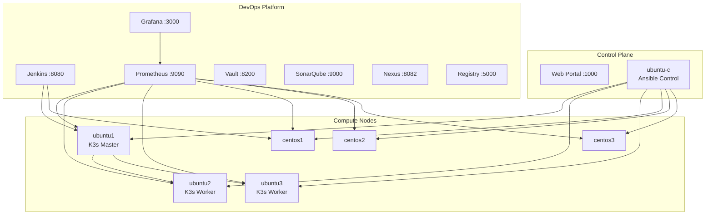

# DevOps Lab Guide

## 🎯 Overview

This is a comprehensive DevOps laboratory environment featuring:
- **Infrastructure**: 7 containerized nodes (Ubuntu & Rocky Linux)
- **CI/CD**: Jenkins
- **Monitoring**: Prometheus, Grafana
- **Security**: HashiCorp Vault
- **Quality**: SonarQube
- **Artifacts**: Nexus Repository, Docker Registry
- **Orchestration**: K3s Kubernetes cluster

## 🏗️ Architecture



## 📦 Service Inventory

### Infrastructure Nodes

| Node | OS | Role | SSH Port | Terminal Port |
|------|----|----|---------|--------------|
| ubuntu-c | Ubuntu 22.04 | Control Node | 2221 | 7681 |
| ubuntu1 | Ubuntu 24.04 | K3s Master | 2222 | 7682 |
| ubuntu2 | Ubuntu 24.04 | K3s Worker | 2223 | 7683 |
| ubuntu3 | Ubuntu 24.04 | K3s Worker | 2224 | 7684 |
| centos1 | Rocky Linux 9 | Target Node | 2225 | 7685 |
| centos2 | Rocky Linux 9 | Target Node | 2226 | 7686 |
| centos3 | Rocky Linux 9 | Target Node | 2227 | 7687 |

### DevOps Services

| Service | Port | Purpose | Credentials |
|---------|------|---------|-------------|
| Jenkins | 8080 | CI/CD automation | admin/devopslab123 |

| Prometheus | 9090 | Metrics collection | - |
| Grafana | 3000 | Visualization | admin/devopslab123 |
| Vault | 8200 | Secret management | Token: devopslab-root-token |
| SonarQube | 9000 | Code quality | admin/admin |
| Nexus | 8082 | Artifact repository | admin/(see container) |
| Registry | 5000 | Container registry | - |

## 🚀 Quick Start

### 1. Start the Lab

```bash
# Start base infrastructure
docker-compose up -d

# Start DevOps tools
docker-compose -f docker-compose.yaml -f docker-compose-devops.yaml up -d

# View logs
docker-compose logs -f
```

### 2. Access the Portal

Open [http://localhost:1000](http://localhost:1000) in your browser to access the lab dashboard.

### 3. Connect to Control Node

```bash
ssh -p 2221 ansible@localhost
# Password: ansible
```

### 4. Run Your First Playbook

```bash
# On the control node
cd ~/playbooks

# Deploy monitoring
ansible-playbook -i ../inventory/hosts.ini monitoring/01-deploy-node-exporter.yml

# Verify Prometheus
ansible-playbook -i ../inventory/hosts.ini monitoring/02-verify-prometheus.yml

# Setup Grafana
ansible-playbook -i ../inventory/hosts.ini monitoring/03-setup-grafana.yml
```

## 📚 Available Playbooks

### Monitoring Stack
- `monitoring/01-deploy-node-exporter.yml` - Deploy Prometheus exporters
- `monitoring/02-verify-prometheus.yml` - Verify metrics collection
- `monitoring/03-setup-grafana.yml` - Configure Grafana dashboards

### CI/CD
- `jenkins/01-install-jenkins-agent.yml` - Setup Jenkins build agents


### Security
- `security/01-vault-demo.yml` - Demonstrate secret management

### Kubernetes
- `kubernetes/01-deploy-k3s-enhanced.yml` - Deploy K3s cluster
- `kubernetes/02-deploy-sample-app.yml` - Deploy sample application

## 🔄 Common Workflows

### Deploy Full Monitoring Stack

```bash
# 1. Deploy node exporters to all nodes
ansible-playbook -i ../inventory/hosts.ini monitoring/01-deploy-node-exporter.yml

# 2. Verify Prometheus is scraping
ansible-playbook -i ../inventory/hosts.ini monitoring/02-verify-prometheus.yml

# 3. Configure Grafana with dashboards
ansible-playbook -i ../inventory/hosts.ini monitoring/03-setup-grafana.yml

# 4. Access Grafana
open http://localhost:3000
```

### Setup Kubernetes Cluster

```bash
# 1. Deploy K3s
ansible-playbook -i ../inventory/hosts.ini kubernetes/01-deploy-k3s-enhanced.yml

# 2. Deploy sample app
ansible-playbook -i ../inventory/hosts.ini kubernetes/02-deploy-sample-app.yml

# 3. Access application
curl http://localhost:30001
```

### Demonstrate Secret Management

```bash
# Run Vault demo
ansible-playbook -i ../inventory/hosts.ini security/01-vault-demo.yml

# Access Vault UI
open http://localhost:8200
# Token: devopslab-root-token
```

## 🛠️ Pre-installed Tools

### Control Node (ubuntu-c)
- Ansible + Collections (community.general, kubernetes.core, ansible.posix)
- kubectl (Kubernetes CLI)
- helm (Kubernetes package manager)
- terraform (Infrastructure as Code)
- vault (HashiCorp Vault CLI)
- docker CLI
- jq, yq (JSON/YAML processors)
- ansible-lint

### All Nodes
- Docker CE
- node_exporter (Prometheus metrics)
- Python 3
- Git

## 🔍 Troubleshooting

### Services not starting

```bash
# Check container status
docker ps -a

# View logs for specific service
docker logs jenkins


# Restart a service
docker-compose restart jenkins
```

### Can't connect to nodes from control

```bash
# Verify network connectivity
ansible -i inventory/hosts.ini all -m ping

# Check SSH keys
cat ~/.ssh/id_rsa.pub
```

### Prometheus not scraping targets

```bash
# Check Prometheus targets
curl http://localhost:9090/api/v1/targets

# Verify node_exporter is running on nodes
ansible -i inventory/hosts.ini monitoring -m shell -a "curl localhost:9100/metrics"
```

## 📖 Learning Paths

### Path 1: Ansible Fundamentals
1. Connect to control node
2. Review inventory file
3. Run ad-hoc commands
4. Execute playbooks
5. Create your own playbook

### Path 2: CI/CD Pipeline
1. Setup Jenkins agents
2. Create a sample project
4. Build a pipeline
5. Deploy to Kubernetes

### Path 3: Observability
1. Deploy monitoring stack
2. Explore Prometheus queries
3. Create Grafana dashboards
4. Setup alerts
5. Monitor your applications

### Path 4: GitOps
1. Setup Git repository
2. Create deployment manifests
3. Configure automated deployments
4. Implement blue/green deployments

## 🔒 Security Notes

> [!WARNING]
> This lab uses default passwords and tokens for educational purposes only.
> **Never use these credentials in production environments!**

### Default Credentials Summary
- SSH: `ansible/ansible`
- Jenkins: `admin/devopslab123`

- Grafana: `admin/devopslab123`
- Vault Token: `devopslab-root-token`
- SonarQube: `admin/admin`

## 🎓 Next Steps

1. **Explore the examples** in the `examples/` directory
2. **Read the exercises** in `docs/EXERCISES.md`
3. **Build your own pipelines** and automation
4. **Experiment** with different configurations
5. **Break things and fix them** - that's how you learn!

## 📞 Support

- GitHub Issues: Report bugs or request features
- Documentation: Check `docs/` directory for detailed guides
- Web Portal: [http://localhost:1000](http://localhost:1000)

---

**Happy Learning! 🚀**
